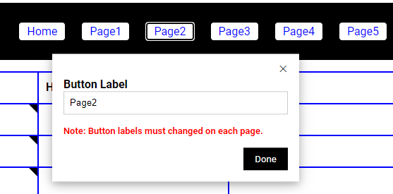

**mySites** ver 0.20 sfarrand.com 03/01/2021 12:00pm

# What is mySites?

mySites is a personal start page “app” built on standard CSS, HTML and
JavaScript for local use on your computer allowing you to conveniently access
your favorite and most frequently visited web sites. mySites organizes six pages
(Home + 5 other pages) of your specified web sites on a grid of 65 (13 rows x 5
columns) cells for a total of 390 individual links that can easily be accessed
according to categories (page navigation buttons) and subcategories (column
headings) that you define. Figure 1 below shows the home page layout of mySites.

Figure 1 - mySites Home Screen

# Where to get mySites

The mySites “app” can be downloaded from <https://www.sfarrand.com/mysites>.
Choose either the self-extracting mySites.exe or the zip file mySites.zip.
mySites is available free for your convenience although we always [welcome a
donation](https://www.sfarrand.com/payments) so we can continue to advance and
support our downloadable solution for you.

Developers can access mySites at: [sfarrand/mySites
(github.com)](https://github.com/sfarrand/mySites)

# How to “install” mySites?

“Installing” mySites is no more that extracting the mySites file bundle to a
folder on your computer and then double clicking the index.html file to render
the browser screen you see in figure 1.

Download mySites.exe (windows 10) or mySites.zip (mac or Linux), place file in
the folder of your choice and then extract the files by executing the
mySites.exe self-extracting zip file or unzipping mySites.zip.

The file hierarchy in a folder of your choosing would be as shown in figure 2.

Figure 2 – mySites file hierarchy

Once the files are extracted, double click the index.html file to bring up
mySites as shown in figure 1.

# Usage

## Populate a page grid of URLs

Each page represented by a button on the navigation bar is a grid of URLs that
you input including a meaningful label to click to access your site. To populate
the URLs, press the \<Edit\> button in the lower left corner. You will see each
cell in the grid form a “hot spot” in the upper left corner of the cell.
Clicking the hot spot will present a dialog for you to enter the fully qualified
URL and your personalized label as shown in figure 3 below.

Figure 3 – Input/Edit Hyperlink to a site

Continue populating as many grid cells as you choose, it is OK to leave blank
cells. Press the “Done” button on the dialog box to save the URL in the cell.
Once finished populating the cells with your preferred web sites press the
\<Save\> button in the lower left corner. The browser will behave as if you are
downloading a file to your computer. Select the browser’s \<Save as\> and save
the file in the “mySites” folder using the suggested file name for the page (eg,
index.html, Page1.html, Page2.html, …). You should notice the hot spots are
removed and the label you input into each cell are now “live” links to your
sites’ URLs. Congratulations you have just created your first [or partial] page
of links to your sites!

## Label the navigation buttons

Notice the navigation buttons across the top of any page. The initial navigation
bar looks as shown in figure 4.

Figure 4 – Initial navigation bar

To label the buttons with a word that categorizes the links on that page you
follow a similar procedure as you did for input/editing URLs. Specifically,
press the edit button in the lower left corner. Now press the navigation button
itself and you will see the dialog in figure 5 appear on screen.

Figure 5 – Edit the navigation button

Type over the default “Page2” label with a meaningful label of your choice that
represents the collection of URLs you plan to populate on that page. It is
important to note that you must go to each page and edit that button to the same
name. After each page has the button names you prefer you will “save” each page
by pressing the \<Save\> button in the lower left corner. Again the browser will
behave as if you are downloading a file. Select the browser’s \<Save as\> to
save the page in the mySites folder preserving the page name suggested in the
\<Save as\> dialog prompt.

## Label the Column Headings

The column headings on each page can also be customized to meaningful
sub-category names that you prefer. To edit the column headings a similar
procedure is used. Press the \<Edit\> button in the lower left. Then use the
mouse to select or directly highlight the heading label. Instead of a dialog box
you will just type the heading label directly into the cell. To save and finish
press the \<Save\> button. The browser will behave as if you are downloading a
file once again. Select \<Save as\> to save the page in the mySites folder
preserving the page name suggested in the \<Save as\> dialog.

# *Edit Mode*

Note that when you press the \<Edit\> button in the lower left you enter into
*Edit Mode*. While in Edit Mode you can perform any of the three functions: 1)
Input/Edit URL, 2) Edit Button labels or 3) Edit Column headings on a single
page. When initially using mySites it is convenient to fill out as much of a
page in a session as you know to do at that time and then save the page. It is
important to note that navigation button labels must be edited to the same name
on each page. For example, change button \<Page1\> on the home page to
\<Streaming Sites\> does not change that label on Page2 thru Page5. You much
change the \<Page1\> button label on each of those pages to \<Streaming Sites\>.

# Revision Log

## Ver 0.20

-   Position footer as fixed at bottom on browser and inspire vertical scroll
    bar.

-   Ridge border around header and footer.

## Ver 0.16

Precisely same as ver 0.15 except:

-   Updated javascript clock to be in am/pm format versus military time.

## Ver 0.15

First ‘beta’ release with base functions of:

-   6 customizable buttons for each page of sites representing a category of
    sites.

-   5 customizable column labels for each page representing a sub-category of
    sites.

-   1 dedicated button that links directly to google search.

Please provide any feedback to: <scott@sfarrand.com>

## Ver 0.12

Pre-release to alpha testers.

# Supported Web Browsers

mySites has been tested in the following browsers: MS Edge, Chrome, Safari and
Mozilla Firefox

Windows Chrome

Mac Safari

# Tips & Tricks

## URL Types: http, https, mailto, file, ftp

The URLs you input into mySites respect the same URLs of the browser you’re
using. Of course, that would include http, https and typically mailto, file and
ftp. Some browsers support additional address prefixes representing other
protocols. mySites passes those to the browser to take the action it would
normally take. For example,
[mailto:scott\@sfarrand.com](mailto:scott@sfarrand.com) populated in the URL of
a cell will bring up your mail client and start an email to that address. This
mechanism can be used in many convenient ways. For example, you can access your
local file system (eg. file:///C:/users/myHome/ /documents/…) or open and
application with a file loaded (eg. file:///C:/users/myHome/
/documents/xls/finance.xls)

## New Tab Extension

mySites is quite useful to set as your browser start page – give it a try. Most
new browsers no longer allow you to set a specified page for a new tab. The
newer MS Edge (based on chromium) and Chrome do have an extension called “[New
Tab
Redirect](https://chrome.google.com/webstore/detail/new-tab-redirect/icpgjfneehieebagbmdbhnlpiopdcmna)”
that allows you to specify a URL to render upon creating a new tab. Just point
the New Tab Redirect extension to render your local page in mySites, index.html,
to instantly bring up the sites you populated in mySites.

## Personalized Avatar

One fun finishing touch is to put your own Avatar in the heading. This is done
simply by replacing the file “mySites_avatar.png” in the mySights/images folder
with a graphic of your avatar. An ideal size of the graphic is 128 x 128 pixels
to 100 x 100 pixels.

# License

mySites is Copyright © 2021 sfarrand and licensed under the MIT License.
